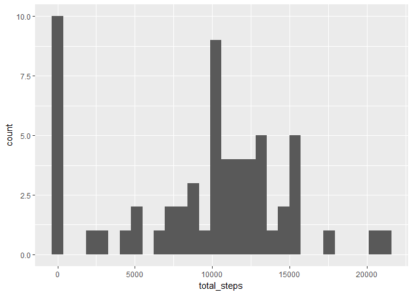
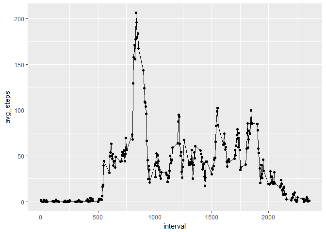
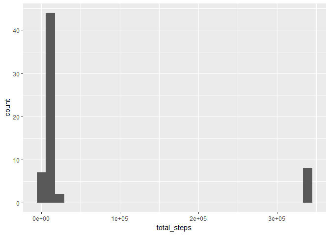
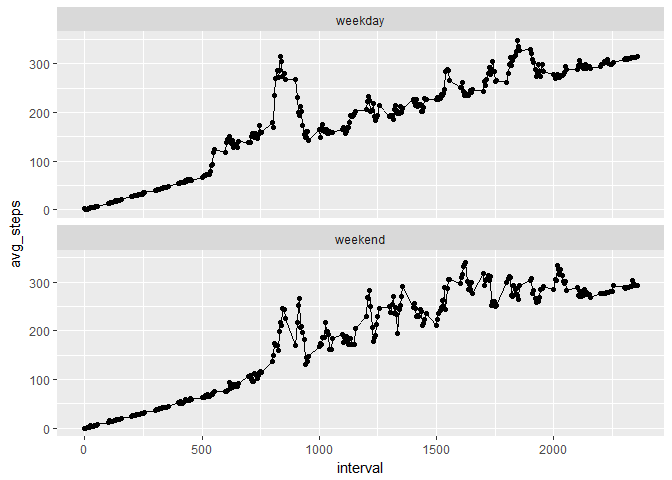

# Reproducible Research: Peer Assessment 1


## Loading and preprocessing the data

Here we read in our data:


```r
data <- read.csv("C:/Users/RyanCaldwell/Documents/coursera/Reproducible_Research/Project1/activity.csv")
```

Next we want to convert the data into a data table and see the structure of table:


```r
library(data.table)
df <- data.table(data)
str(df)
```

```
## Classes 'data.table' and 'data.frame':	17568 obs. of  3 variables:
##  $ steps   : int  NA NA NA NA NA NA NA NA NA NA ...
##  $ date    : Factor w/ 61 levels "2012-10-01","2012-10-02",..: 1 1 1 1 1 1 1 1 1 1 ...
##  $ interval: int  0 5 10 15 20 25 30 35 40 45 ...
##  - attr(*, ".internal.selfref")=<externalptr>
```

We notice that the date field is not in a date format. Here we convert the date column:


```r
df$date <- as.Date(as.character(df$date), format="%Y-%m-%d")
```

Now check the table structure:


```r
str(df)
```

```
## Classes 'data.table' and 'data.frame':	17568 obs. of  3 variables:
##  $ steps   : int  NA NA NA NA NA NA NA NA NA NA ...
##  $ date    : Date, format: "2012-10-01" "2012-10-01" ...
##  $ interval: int  0 5 10 15 20 25 30 35 40 45 ...
##  - attr(*, ".internal.selfref")=<externalptr>
```

We also want to get an idea of how many different days of data we are dealing with. This is important for subsequent analyses in the report.


```r
unique(df$date)
```

```
##  [1] "2012-10-01" "2012-10-02" "2012-10-03" "2012-10-04" "2012-10-05"
##  [6] "2012-10-06" "2012-10-07" "2012-10-08" "2012-10-09" "2012-10-10"
## [11] "2012-10-11" "2012-10-12" "2012-10-13" "2012-10-14" "2012-10-15"
## [16] "2012-10-16" "2012-10-17" "2012-10-18" "2012-10-19" "2012-10-20"
## [21] "2012-10-21" "2012-10-22" "2012-10-23" "2012-10-24" "2012-10-25"
## [26] "2012-10-26" "2012-10-27" "2012-10-28" "2012-10-29" "2012-10-30"
## [31] "2012-10-31" "2012-11-01" "2012-11-02" "2012-11-03" "2012-11-04"
## [36] "2012-11-05" "2012-11-06" "2012-11-07" "2012-11-08" "2012-11-09"
## [41] "2012-11-10" "2012-11-11" "2012-11-12" "2012-11-13" "2012-11-14"
## [46] "2012-11-15" "2012-11-16" "2012-11-17" "2012-11-18" "2012-11-19"
## [51] "2012-11-20" "2012-11-21" "2012-11-22" "2012-11-23" "2012-11-24"
## [56] "2012-11-25" "2012-11-26" "2012-11-27" "2012-11-28" "2012-11-29"
## [61] "2012-11-30"
```

Now it might be informative to know how many observations we have for each day, since that will play a part in the average.


```r
library(dplyr)
```

```
## -------------------------------------------------------------------------
```

```
## data.table + dplyr code now lives in dtplyr.
## Please library(dtplyr)!
```

```
## -------------------------------------------------------------------------
```

```
## 
## Attaching package: 'dplyr'
```

```
## The following objects are masked from 'package:data.table':
## 
##     between, first, last
```

```
## The following objects are masked from 'package:stats':
## 
##     filter, lag
```

```
## The following objects are masked from 'package:base':
## 
##     intersect, setdiff, setequal, union
```

```r
df %>%
  group_by(date) %>%
  summarise(n = n())
```

```
## # A tibble: 61 × 2
##          date     n
##        <date> <int>
## 1  2012-10-01   288
## 2  2012-10-02   288
## 3  2012-10-03   288
## 4  2012-10-04   288
## 5  2012-10-05   288
## 6  2012-10-06   288
## 7  2012-10-07   288
## 8  2012-10-08   288
## 9  2012-10-09   288
## 10 2012-10-10   288
## # ... with 51 more rows
```

From this, we see there are 288 observations for each day.

## What is mean total number of steps taken per day?

Here we want to calculate the total number of steps each day:


```r
total_steps <- df %>%
  group_by(date) %>%
  summarise(total_steps = sum(steps, na.rm = TRUE))

head(total_steps)
```

```
## # A tibble: 6 × 2
##         date total_steps
##       <date>       <int>
## 1 2012-10-01           0
## 2 2012-10-02         126
## 3 2012-10-03       11352
## 4 2012-10-04       12116
## 5 2012-10-05       13294
## 6 2012-10-06       15420
```

Now we need to plot the results:


```r
library(ggplot2)
ggplot(data=total_steps, aes(total_steps)) + geom_histogram()
```

```
## `stat_bin()` using `bins = 30`. Pick better value with `binwidth`.
```

<!-- -->

Now we need to summarize this data by mean and median:


```r
mean(total_steps$total_steps)
```

```
## [1] 9354.23
```

```r
median(total_steps$total_steps)
```

```
## [1] 10395
```

## What is the average daily activity pattern?

First we need to create our dataframe of observations:


```r
mean_steps <- df %>%
  group_by(interval) %>%
  summarise(avg_steps = mean(steps, na.rm = TRUE))
head(mean_steps)
```

```
## # A tibble: 6 × 2
##   interval avg_steps
##      <int>     <dbl>
## 1        0 1.7169811
## 2        5 0.3396226
## 3       10 0.1320755
## 4       15 0.1509434
## 5       20 0.0754717
## 6       25 2.0943396
```

Now we need to plot the data:


```r
ggplot(data=mean_steps, aes(x=interval, y=avg_steps)) + 
  geom_line() +
  geom_point()
```

<!-- -->

Now we want to know which interval, on average, has the most steps:


```r
mean_steps$interval[which.max(mean_steps$avg_steps)]
```

```
## [1] 835
```

## Imputing missing values

Total number of NAs in data:


```r
sum(colSums(is.na(df)))
```

```
## [1] 2304
```

We will replace NAs with the average number of steps for that interval


```r
nas_replaced <- df
for(i in 1:nrow(nas_replaced)){
  if(is.na(nas_replaced$steps[i]) == TRUE){
    interval_type = nas_replaced$interval[i]
    x <- nas_replaced[nas_replaced$interval == interval_type,]
    interval_mean <- mean(x$interval, na.rm = TRUE)
    nas_replaced$steps[i] <- interval_mean
  }
}
```

Now let's see how the average steps after imputation compares to before imputation:


```r
total_steps <- nas_replaced %>%
  group_by(date) %>%
  summarise(total_steps = sum(steps, na.rm = TRUE))
```


```r
ggplot(data=total_steps, aes(total_steps)) + geom_histogram()
```

```
## `stat_bin()` using `bins = 30`. Pick better value with `binwidth`.
```

<!-- -->


```r
mean(total_steps$total_steps)
```

```
## [1] 53828.98
```

```r
median(total_steps$total_steps)
```

```
## [1] 11458
```

We see that the median only changed by around 1,000 steps, but the mean changed by a ton!


## Are there differences in activity patterns between weekdays and weekends?

We want to see if average steps is different for weekdays and weekends


```r
nas_replaced$weekend <- as.factor(ifelse(weekdays(nas_replaced$date) %in% c('Saturday','Sunday'), 'weekend', 'weekday'))

mean_steps <- nas_replaced %>%
  group_by(interval, weekend) %>%
  summarise(avg_steps = mean(steps, na.rm = TRUE))
head(mean_steps)
```

```
## Source: local data frame [6 x 3]
## Groups: interval [3]
## 
##   interval weekend avg_steps
##      <int>  <fctr>     <dbl>
## 1        0 weekday  2.022222
## 2        0 weekend  0.000000
## 3        5 weekday  1.066667
## 4        5 weekend  0.625000
## 5       10 weekday  1.488889
## 6       10 weekend  1.250000
```

```r
ggplot(data = mean_steps, aes(x=interval, y=avg_steps)) +
  geom_line() +
  geom_point() +
  facet_wrap(~weekend, nrow=2)
```

<!-- -->
